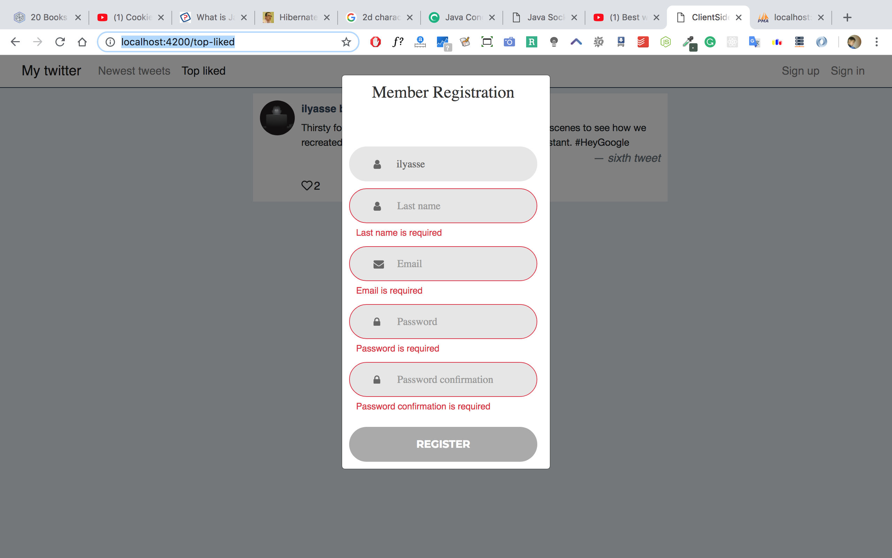

# Twitter clone built using Angular 7 and nestJs

> ### Made with 

[](https://github.com/ellerbrock/typescript-badges/)
[](https://travis-ci.org/affilnost/angular5-example-shopping-app.svg?branch=master)


## UI Description
The app provides a possibility to maintain tweets.

- Authentication [using **Mysql**]
- CRUD Tweet
- CRUD Users


## Features
- Angular 7
- Routing
- Material Design
- Responsive layout (flex layout module)
- RxJS/Observables
- Angular forms
- Http
- Following the best practices!
- Mysql
- ORM Type
- NestJs


# Getting started
You need to have `Node.js` and `npm` installed on your PC/Mac.

Make sure you have the [Angular CLI](https://github.com/angular/angular-cli#installation) installed globally. We use [npm](https://www.npmjs.com/) to manage the dependencies, so we strongly recommend you to use it. you can install it from [Here](https://www.npmjs.com/get-npm), then run `npm install` to resolve all dependencies (might take a minute).

Run `ng serve` for a dev server. Navigate to `http://localhost:4200/`. The app will automatically reload if you change any of the source files.





### Get the Code

Either clone this repository or fork it on GitHub and clone your fork:

```
git clone https://github.com/benrkia/nestjs-angular
cd nestjs-angular
```

### App Server

Our backend application server is a NodeJS application that relies upon some 3rd Party npm packages.  You need to install these:

* Install local dependencies (from the project root folder):

    ```
    cd server-side
    npm install
    cd ..
    ```

  (This will install the dependencies declared in the server/package.json file)

### Client App

Our client application is a straight HTML/Javascript application but our development process uses a Node.js 
* Install local dependencies (from the project root folder):

    ```
    cd client-side
    npm install
    cd ..
    ```

  (This will install the dependencies declared in the client/package.json file)
### Building the project
Run `ng build` to build the project. The build artifacts will be stored in the `dist/` directory. Use the `-prod` flag for a production build.

## Building

### Configure Server
The server stores its data in a Mysql database.
* Edit `nestjs-angular/server-side/ormconfig.json` to setup the database .

    ```
   {
    "type": "mysql",
    "host": "localhost",
    "port": 3306,
    "username": "root",
    "password": "root",
    "database": "twitter",
    "entities": ["src/**/**.entity{.ts,.js}"],
    "synchronize": true
  }

    ```
* Import `nestjs-angular/db/twitter.sql`.